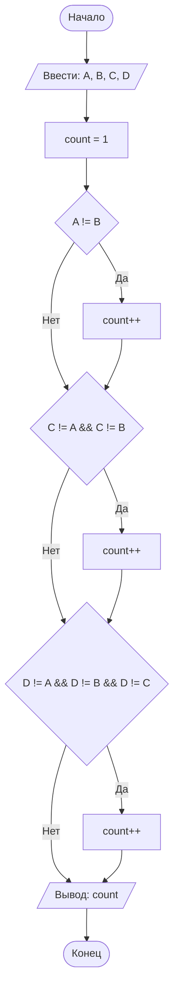

## Отчет по лабораторной работе № 1

#### № группы: `ПМ-2602`

#### Выполнил: `Касьянов Максим Дмитриевич`

#### Вариант: `9`

### Cодержание:

- [Постановка задачи](#1-постановка-задачи)
- [Входные и выходные данные](#2-входные-и-выходные-данные)
- [Выбор структуры данных](#3-выбор-структуры-данных)
- [Алгоритм](#4-алгоритм)
- [Программа](#5-программа)
- [Анализ правильности решения](#6-анализ-правильности-решения)

### 1. Постановка задачи

> Четыре квадрата с длинами сторон A, B, C и D пытаются расположить друг над другом, начиная с самого большого. Можно ли разместить все квадраты так, чтобы каждый следующий был строго меньше предыдущего? Вывести количество квадратов, которые удастся разместить в таком порядке. На вход программы подаются натуральные числа A, B, C, D.

Даны четыре натуральных числа — длины сторон квадратов. Необходимо упорядочить их по убыванию и проверить, можно ли их разместить так, чтобы каждый следующий квадрат был строго меньше предыдущего. То есть найти количество квадратов, которые можно выстроить в строго убывающую последовательность, начиная с самого большого. Для того,чтобы их выстроить, необходимо узнать, есть ли повторы среди длин сторон квадратов.
 1. Например, при A = 4, B = 3, C = 2, D = 1. Повторов нет A>B>C>D. То есть мы можем разместить все 4 квадрата в строго убывающую последовательность
 2. А вот например, при A = 5, B = 5, C = 3, D = 2. Уже A и B имеют одинаковую длину сторон, следовательно, нам нужно исключить повтор. Таким образом, мы сможем разместить только 3 квадрата в строго убывающую последовательность.

### 2. Входные и выходные данные

#### Данные на вход
На вход программа должна получать 4 натуральных числа(A, B, C, D), с типом данных - целые числа. Ограничение снизу: >0, то есть минимальное значение - 1.

|                 | Тип данных        | ограничение | min значение |
|-----------------|-------------------|-------------|--------------|
| A (1ая сторона) | Натуральное число | >0          | 1            | 
| B (2ая сторона) | Натуральное число | >0          | 1            |
| C (3ая сторона) | Натуральное число | >0          | 1            |
| D (4ая сторона) | Натуральное число | >0          | 1            |

#### Данные на выход

Так как программа должна вывести количество квадратов, которые удастся разместить в строго убывающей последовательности, то на выход мы поличим единственное целое положительное число, которое не превышает 4.

|         | Тип                       | min значение | max значение |
|---------|---------------------------|--------------|--------------|
| Число 1 | Целое положительное число | 1            | 4            |

### 3. Выбор структуры данных

Программа получает 4 натуральных числа(длины сторон квадратов). Поэтому для их хранения можно выделить 4 переменных (`A`,`B`,`C`,`D`) типа `int`
Для вывода количества квадратов, которые можно разместить в строго убывающей порядке, выделим счетную переменную `count` типа `int`

|                 | название переменной | Тип (в Java) | 
|-----------------|---------------------|--------------|
| A (1ая сторона) | `A`                 | `int`        |
| B (1ая сторона) | `B`                 | `int`        |
| C (1ая сторона) | `C`                 | `int`        |
| D (1ая сторона) | `D`                 | `int`        |
| (Счётчик)       | `count`             | `int`        |

### 4. Алгоритм

#### Алгоритм выполнения программы:

1. **Ввод данных:**  
   Программа считывает четыре целых числа, обозначенные как `A`, `B`, `C`, `D`.
   Затем создает счётчик `count` и присваивает ему значение - `1`(так как, когда равны даже все четыре квадрата, мы можем поставить 1 квадрат).
2. **Проверяем на равенство 1ую сторону со второй:**
    если они различны, то значит, какая-то одна из них больше другой, вследствии счётчик(`count`) увеличивается на 1.
3.  **Проверяем на равенство 1ую сторону с третьей и вторую с третьей:**
    если они различны, то значит третья сторона отлична от первой и второй, вследствии счётчик(`count`) увеличивается на 1.
4.  **Проверяем на равенство 1ую сторону с четвертой, вторую с четвертой, третью с четвертой:**
    если они различны, то значит четвертая сторона отлична от первой, второй и третьей, вследствии счётчик(`count`) увеличивается на 1.
5. **Вывод результата:**  
   На экран выводится количетсво квадратов, которые можно разместить в строго убывающей последовательности.

#### Блок-схема



### 5. Программа

```java 
import java.io.PrintStream;
import java.util.Scanner;

public class Main {
    // Объявляем объект класса Scanner для ввода данных  
    public static Scanner in = new Scanner(System.in);
    // Объявляем объект класса PrintStream для вывода данных
    public static PrintStream out = System.out;

    public static void main(String[] args){ 
        // Считываем четыре целых числа(длины сторон A,B,C,D) из консоли
        int A = in.nextInt();
        int B = in.nextInt();
        int C = in.nextInt();
        int D = in.nextInt();

        // Создаем счётчик(в который будем записывать количество квадратов, которые можно выстроить в строго убывающую последовательность) и присваиваем ему значение 1
        // (Начальное значение 1, потому что первый квадрат(самый большой) всегда можно поставить)
        int count = 1;
       
        // Сравниваем значения А и В (чтобы узнать, различные ли они)
        if (A != B) {
            // Если А и В различны, то увеличивает count(наш счетчик) на 1
            count++;
        }

        // сравниваем С с А и В
        if (C != A && C != B) {
            // Если С отлична от А и отлична от В, то увеличиваем count на 1
            count++;
        }

        // Сравниваем D с А, D с В и D с С
        if (D != A && D != B && D != C) {
            // Если D отлична от А, отлична от В, отлична от С, то увеличиваем count на 1
            count++;
        }
        // Выводим count(наш счетчик, указывающий на количество квадратов, которые можно выстроить в строго убывающую последовательность)
        out.println(count);
    }
}
```

### 6. Анализ правильности решения

Программа работает корректно на всем множестве решений.

1. Тест: все числа различны
- **Input**:
        ```
        1 2 3 5
        ```

    - **Output**:
        ```
        4
        ```
2. Тест: два одинаковых числа
- **Input**:
        ```
        5 5 2 4
        ```

    - **Output**:
        ```
        3
        ```
3. Тест: все числа одинаковы
- **Input**:
        ```
        2 2 2 2
        ```

    - **Output**:
        ```
        1
        ```
4. Тест: две пары одинаковых чисел
- **Input**:
        ```
        2 2 6 6
        ```

    - **Output**:
        ```
        2
        ```
5. Тест: три одинаковых числа
- **Input**:
        ```
        7 7 7 2
        ```

    - **Output**:
        ```
        2
        ```
6. Тест: при минимальных значениях
- **Input**:
        ```
        1 1 1 1
        ```

    - **Output**:
        ```
        1
        ```
